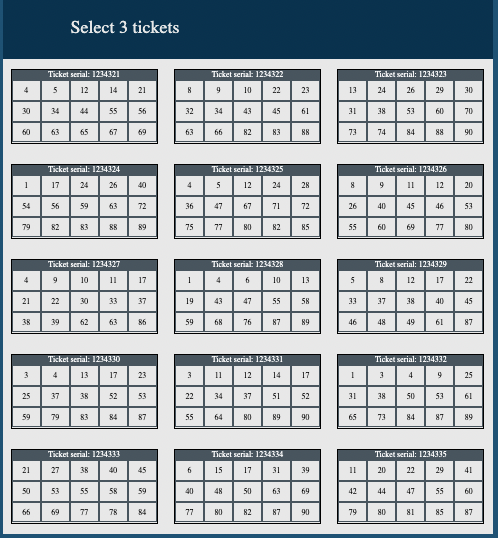
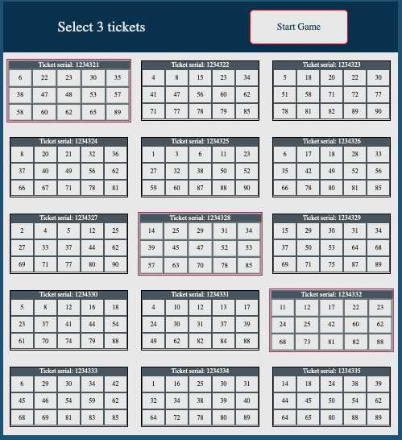
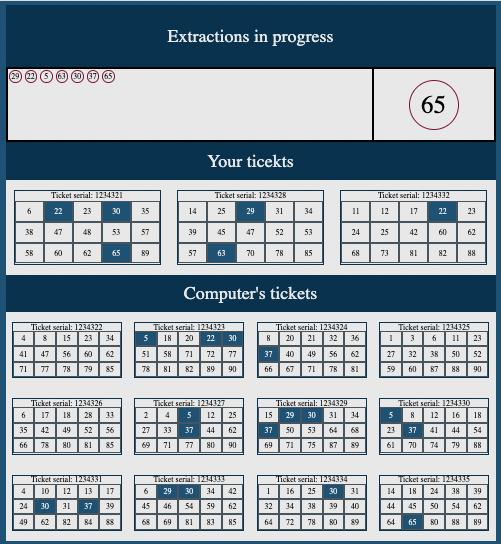
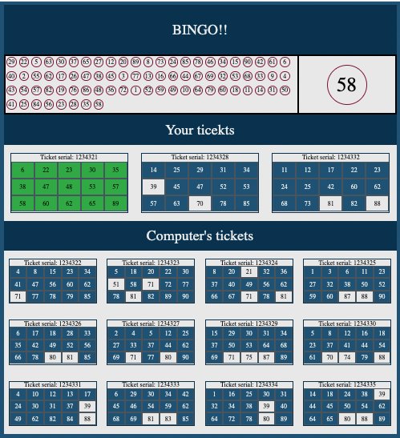

# Bingo Game

A classic bingo game

## Objective

To build a bingo game Persson vs Computer with the following features:

* A player can select 3 tickets out of 15

* Once the selection is done, the remaining 12 tickets will belong to the computer

* Automatic extractions will happen every second (increasablle/decreasable for slower/faster game)

* Numbers will be extracted until one of the tickets in game will match all of its numbers

## Skills and technical aspects to focus on

* Creating a multi-stage game in which the content changes dinamically thorough the game
* Using JavaScript to create the logic for the creation of random ticket and other aspects of the game
* Practising timer functions to make periodic random number extractions

## Links

[Try the demo of the game](https://www.theodhorshyti.com/bingo.html)